  

  

 

  

  <h3>🚀 About Me</h3>

  I'm a passionate developer specializing in <strong>Cybersecurity, Networking, and UI/UX Design</strong>.  
  I love exploring new technologies and solving complex problems across various fields.

  🔭 Check out my work at <strong><a href="https://kasunc.uk/" target="_blank">kasunc.uk</a></strong> 
  💬 Ask me about <strong>Cybersecurity, Networking & System Administration</strong> 
  📫 Reach me at <strong><a href="https://www.linkedin.com/in/kasuncsb/" target="_blank">LinkedIn</a></strong>

 
  <h3>🛠️ Tech Stack</h3>

  <!-- Languages -->
  
<strong>Languages</strong>
 
    
    
    
    
    
    
    
    
    
    
    
    
    

  <!-- Frontend & Design -->
  
<strong>Frontend & Design</strong>
 
    
    
    
    
    
    
    

  <!-- Backend & Database -->
  
<strong>Backend & Database</strong>
 
    
    
    
    
    
    
    
    

  <!-- Cloud & DevOps -->
  
<strong>Cloud & DevOps</strong>
 
    
    
    
    
    
    
    
    
    
    
    

 

  <h3>📊 GitHub Stats</h3>
    
    
   
    

 

  <h3>🔗 Connect & Support</h3>
  
  
  
  
  

 

  

  

